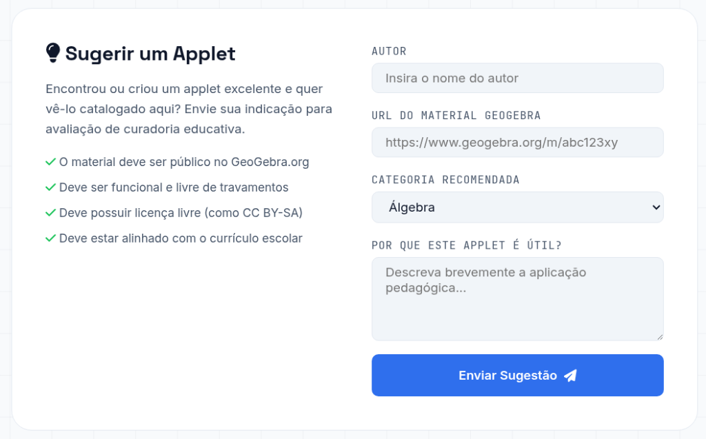

# Como Sugerir um Novo Applet 💡

Agradecemos o seu interesse em contribuir para o portal **GeoGebra Applets**! Para garantir a qualidade pedagógica e técnica dos materiais disponibilizados, as indicações passam por uma curadoria educativa.

---

## 🌐 Como enviar uma sugestão?

Para sugerir um novo applet, você deve acessar a seção de sugestões diretamente no site oficial:

👉 **[https://geogebra.prof-edigleyalexandre.com/#sugerir](https://geogebra.prof-edigleyalexandre.com/#sugerir)**

---

## 📝 Diretrizes para Envio

Ao enviar um applet, certifique-se de que ele cumpre os seguintes requisitos (conforme exibido no formulário de envio):

* **Público no GeoGebra**: O material deve estar configurado como "Público" no site oficial do [GeoGebra.org](https://www.geogebra.org).
* **Funcional e Estável**: Deve carregar corretamente, ser interativo e estar livre de travamentos ou erros de execução.
* **Licença Livre**: Deve possuir uma licença de uso livre (como a licença padrão **CC BY-SA** do GeoGebra) que permita o uso educacional gratuito.
* **Alinhamento Curricular**: O conteúdo matemático abordado no applet deve estar alinhado com o currículo escolar (Ensino Fundamental, Médio ou Superior).

---

## 🖼️ Formulário de Envio

No site, você encontrará este formulário para preencher os dados do applet:

### Informações necessárias no formulário:
1. **Autor**: Insira o nome do criador original do material.
2. **URL do Material GeoGebra**: Link completo do recurso (ex: `https://www.geogebra.org/m/abc123xy`).
3. **Categoria Recomendada**: Escolha a área da matemática correspondente (Álgebra, Geometria Plana, Geometria Espacial, Trigonometria, Cálculo, etc.).
4. **Por que este applet é útil?**: Faça uma breve descrição sobre a aplicação pedagógica prática do applet (como ele ajuda a ensinar/aprender o conteúdo).

---

## 🔍 O que acontece depois do envio?
Toda sugestão enviada é recebida pela nossa equipe de curadoria. O applet será analisado tecnicamente (funcionamento, licenças, compatibilidade com dispositivos móveis) e pedagogicamente. 

Se aprovado, o novo applet será inserido no arquivo de banco de dados do catálogo (`data/applets.json`) e aparecerá automaticamente na grade principal da biblioteca de Applets!
